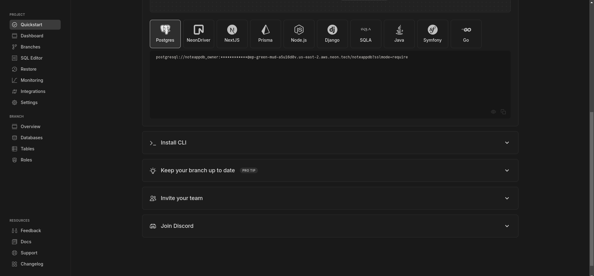
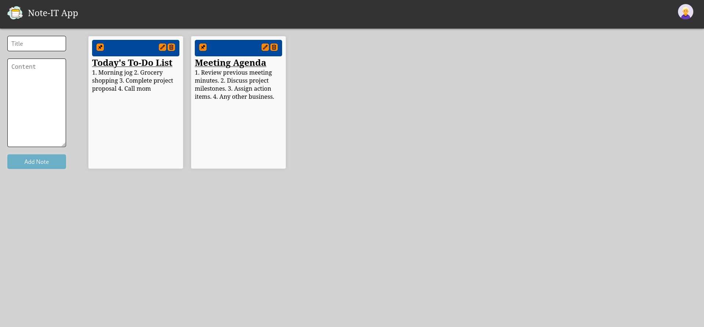

# **Note-IT App**

Note-IT App is a web application for its user gave power create, modify and delete notes easily

## **Table of Contents**

- [Installation](#installation)
- [Usage](#usage)
- [Technologies-Used](#technologies-used)
- [Features](#features)

## **Installation**

```bash
     git clone https://github.com/sumitkpal62/Note-App.git
     cd Note-App
     npm install
```

## Usage

### **Database Setup**

Go to backend directory by `cd backend`
Create a .env file in it

You can use any postgres as a service website for the database

Here, we are using neon database for our applicaion, you can simply setup your account by clicking [Here](https://neon.tech/)

After setting up account put the line shown below in your .env file

> DATABASE_URL = <Your_database_connection_url>

You can find Your_database_connection_url shown in below image



### Start the backend server

Go to backend directory by `cd backend`

Open terminal and type `npm start` to run the server

### Start the fronend server

Got to fronend directory by `cd frontend`

Open terminal and type `npm run dev` to run the server

## Technologies-Used

### 1. ReactJS

React.js is a JavaScript library for building user interfaces, developed and maintained by Facebook. It enables developers to create interactive and dynamic UI components for web applications, with a focus on simplicity, performance, and reusability.

- **Key Features**:
  - **Component-Based Architecture**: React encourages a modular approach to building UIs, where each part of the user interface is encapsulated within a reusable component. This promotes code reusability, maintainability, and scalability.
  - **Virtual DOM**: React uses a virtual representation of the DOM to efficiently update the UI. Instead of directly manipulating the DOM, React compares the virtual DOM with the actual DOM and only applies the necessary updates, leading to better performance and faster rendering.
  - **Declarative Syntax**: React utilizes a declarative programming paradigm, where developers describe the desired UI state and React handles the underlying updates. This makes it easier to reason about the application's behavior and maintain consistency across components.
  - **JSX**: React introduces JSX, a syntax extension that allows developers to write HTML-like code within JavaScript. JSX makes it seamless to integrate HTML markup with JavaScript logic, enhancing code readability and developer productivity.
  - **Unidirectional Data Flow**: React follows a unidirectional data flow pattern, where data flows in a single direction from parent to child components. This simplifies data management and reduces the likelihood of bugs, especially in complex applications.

You can read more about react js from its documentation. [Here](https://react.dev/learn)

### 2. Redux-Toolkit

Redux Toolkit is the official, opinionated, batteries-included toolset for efficient Redux development.<br>
It provides a streamlined API, simplifying common Redux use cases like store setup, reducing boilerplate code, and helping developers write Redux logic more efficiently.

- **Key Features**:
  - **Simplified Configuration**: Redux Toolkit reduces the complexity of Redux setup by providing simplified APIs like configureStore for creating a Redux store with sensible defaults.
  - **Immutability Helpers**: It includes utility functions like createSlice and createReducer to handle state updates in a more intuitive and immutable way.
  - **Built-in Middleware**: Redux Toolkit comes with pre-configured middleware like redux-thunk for handling asynchronous logic and redux-devtools-extension for debugging.
  - **Normalized State Management**: With built-in support for the createEntityAdapter, Redux Toolkit makes managing normalized state structures easier, improving performance and scalability.
  - **Modern JavaScript Features**: It embraces modern JavaScript syntax such as ES6 modules, async/await, and arrow functions, promoting cleaner and more readable code.

You can read more about redux-toolkit from its documentation. [Here](https://redux.js.org/tutorials/quick-start)

## Features



- Simple react app with responsive design
- Redux-toolkit for better state management
- User is able to view, create, update and delete notes.
- Simple interface